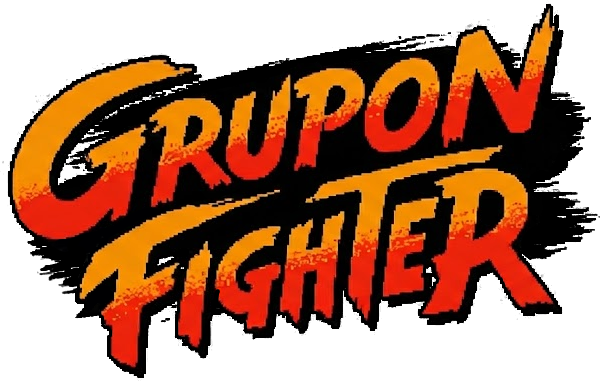

# 👊 A "No-Engine" Retro Fighting Game made with Vanilla JS, HTML & CSS.

Grupon Fighter is a lightweight, browser-based fighting game built for the Grupon crew. Set in the capital of Brazil, Brasília, it features stages based on our favorite local hangouts and characters based on our friends.

It is built to be played anywhere — from a high-end PC to a mobile phone — without any installation or heavy downloads.

# ✨ Features

- **Zero Dependencies**: No Unity, No Phaser, No React. Just pure web technologies.
- **Retro Aesthetics**: 90s arcade feel with CSS-based CRT scanlines and tube distortion effects.
- **Responsive Gameplay**:
  - **Desktop**: Play with a keyboard (Single player vs AI or Local Multiplayer).
  - **Mobile**: Auto-detects mobile devices and renders a virtual Game Boy style controller.
- **Performance**: Highly optimized game loop ensuring 60FPS on almost any device.
- **Local AI**: Fight against the computer (CPU) or challenge a friend on the same screen.

# 🕹️ Controls

The game supports `Keyboard` and `Touch` controls.

| 🎬 Action       |   ⌨️ P1   |   ⌨️ P1   | 📱 Mobile |
| :-------------- | :-------: | :-------: | :-------: |
| Move Left/Right | `A` / `D` | `←` / `→` | `◀` / `▶` |
| Jump            |    `W`    |    `↑`    | `▲` / `B` |
| Punch           |    `F`    |    `K`    |    `A`    |
| Kick            |    `G`    |    `L`    |    `X`    |
| Special         |    `H`    |    `;`    |    `Y`    |
| Start           |  `Enter`  |   `N/A`   |  `Start`  |
| Select          |  `Space`  |   `N/A`   | `Select`  |

> On Mobile, a virtual controller appears automatically on small screens. `Start`: Confirm and `Select`: Toggle AI

# 🚀 How to Run

Because this project uses modern JavaScript Modules (import/export), you need a local server to run it (browsers block modules from running directly from `file://`).

## Option A: VS Code (Easiest)

Install the _Live Server_ extension in **VS Code**. Open `index.html`. Right-click and select "Open with Live Server". It should open the browser, but if not, you can access it through [http://127.0.0.1:3000/](localhost server)

## Option B: Python (Built-in on Mac/Linux)

Open your terminal in the project folder and run:

```Bash# Python 3
python3 -m http.server
```

Then open [http://localhost:8000/](localhost server)

## Option C: Node.js

Open the project folder and run a simple node server:

```Bash
npx serve .
```

# 🎨 How to Customize (Modding Guide)

This game is designed to be easily modded. You can add new friends or stages by editing the JSON-like structures in the code.

## 1. Adding a New Character

Open `js/game.js` and look for the const `characters` object. Add a new entry:

```JavaScript
newFriend: {
    name: "Nickname",
    w: 48, h: 64, scale: 1.7, // Hitbox size and scale
    speed: 9, jumpSpeed: -16,
    moves: {
        punch: { name: "Slap", dmg: 8, ... },
        kick: { name: "Low Kick", dmg: 12, ... }
    },
    anim: {...}
    // Define colors for the placeholder sprites
    idle: { style: "body", color: "#yourColor", accent: "#accentColor" },
    // ... define other states
}
```

## 2. Adding a New Stage

Open `js/stages.js` (or the stages section in `game.js`). Add your hangout spot. It's important to note that the layers here accept `arrays` on `src`, for background animation purposes.

```JavaScript
pontao: {
    name: "Pontão do Lago",
    floorColor: "#4a4a4a",
    layers: [
        // Background layer (Parallax slower)
        { src: 'assets/images/pontao_bg.png', y: 0, scroll: 0.2 },
        // Midground layer
        { src: 'assets/images/pontao_trees.png', y: 100, scroll: 0.5 }
    ]
}
```

# 🛠️ Project Structure

This is an ongoing project, so the structure may very well change in the near future, but it currently looks like this:

```js
/game
├── /assets
│   ├── /fonts
│   ├── /images
│   └── spriteReference.html // Test file for sprites/animations
├── /js
│   ├── /characters
│   ├── /languages
│   ├── /stages
│   ├── game.js // Main engine file, loads all others
│   ├── language.js
│   └── stages.js
├── /style
│   ├── animations.css
│   ├── characterSelection.css
│   ├── crt.css
│   ├── fonts.css
│   ├── hud.css
│   ├── mobile.css
│   ├── splash.css
│   ├── stageSelection.css
│   ├── style.css // Main CSS file, loads all others
│   └── variables.css
├── index.html // Entry point
└── README.md
```

## 🤝 Contributing

This is a personal project for my group of friends, so the main characters and stages are not going to be accepting changes, but the enginge, mechanics and game aspect of the project are open for contributions. Feel free to fork it if you want to build your own version!

---

Made with ❤️ in Brasília.
